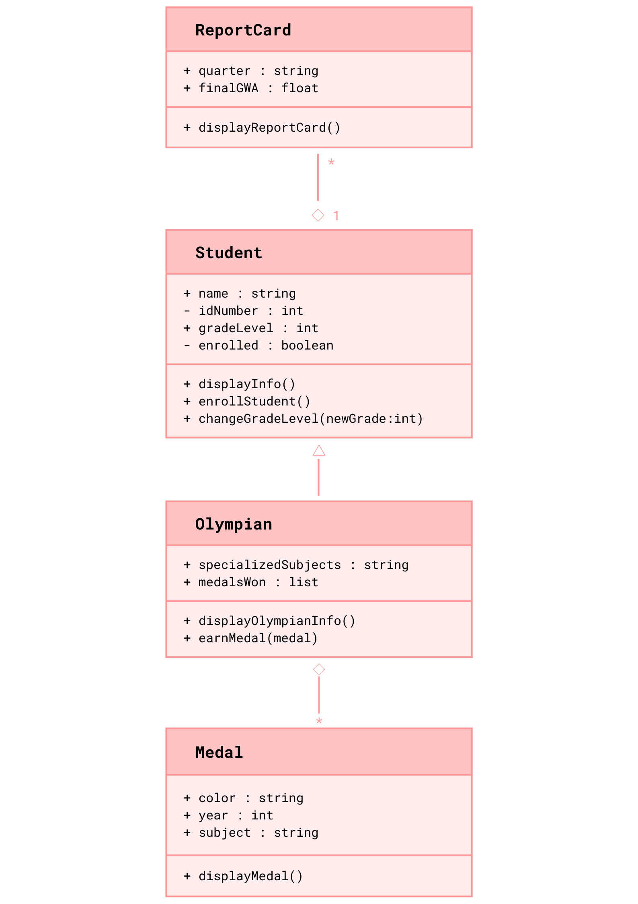
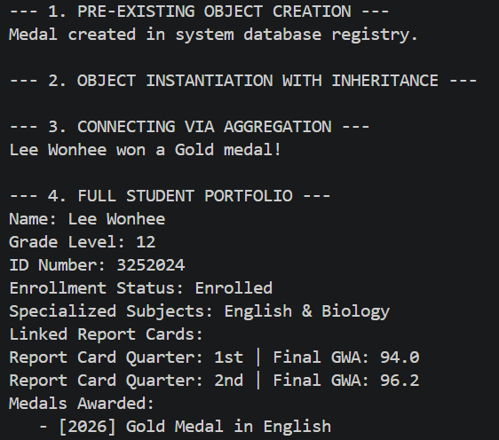
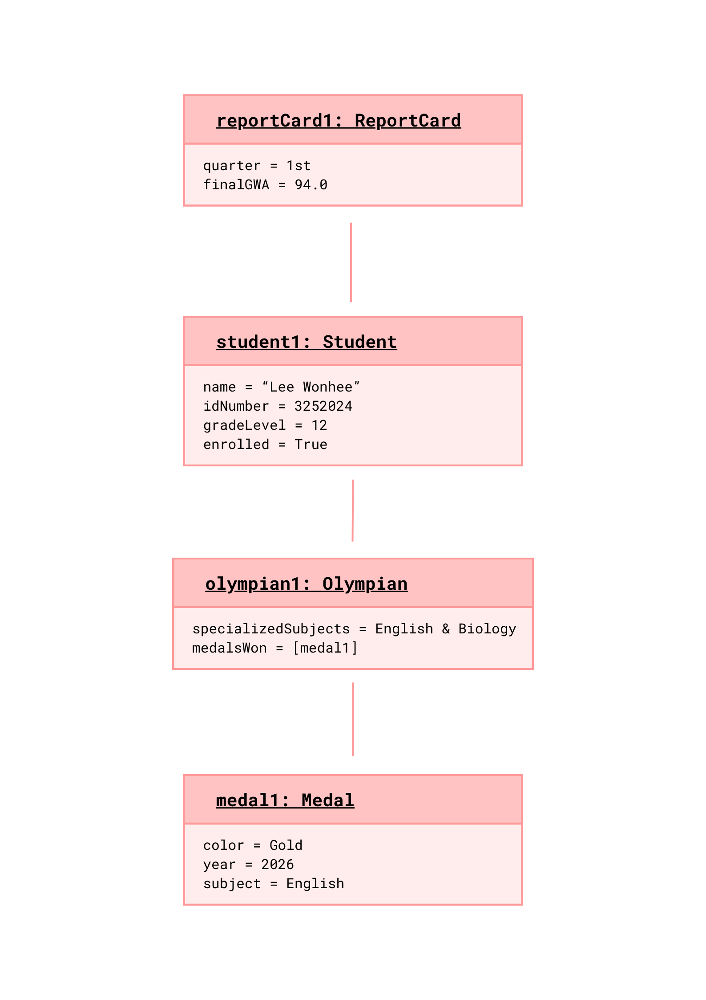

# Advanced Class Relationships
## Previous Activities
[Part I - Classes and Objects](classObjectUML.md) 
[Part II - Class Attributes and Methods](classAttributesMethods.md) 
[Part III - Class Relationships](classRelationships.md)

## Existing System Description:
Class 1: Student 
Class 2: Report Card 
Problems/Limitations: My current design includes a repeated attribute, specifically the gradeLevel variable, which can create inconsistent data. If a student's grade is updated using the changeGradeLevel method, their existing report cards will still hold old data. 

## Inheritance Relationship
Parent: Student 
Child: Olympian 
Explanation: An Olympian is a specific type of student who participates in academic olympiads. They inherit all general student attributes like a name, ID number, grade level, and enrollment status, but also possess unique attributes such as a list of specialized subjects and number of medals won.

## Inheritance UML
[Inheritance](images/inheritanceDiagram.png)

## Aggregation
Class containing another object: Olympian 
Contained object: Medal 
Explanation: An Olympian can earn multiple medals. If an Olympian leaves or is deleted from the system, the Medal objects still exist independently in the school's collection to track the school's overall wins.

## Advanced UML Diagram

## Python Implementation
[Source Code](advancedRelationships.py)
## Test Run

## Object Diagram

## Reflection
### Why did you choose your inheritance relationship? Explain why your child class is a type of your parent class.

### How did inheritance reduce duplicate code? Identify attributes or methods that were reused.

### Why is your HAS-A relationship Composition or Aggregation? Explain the lifecycle relationship between the two objects.

### What is the difference between Association from Part III and the advanced relationship you implemented?

### How does your design follow the DRY principle?