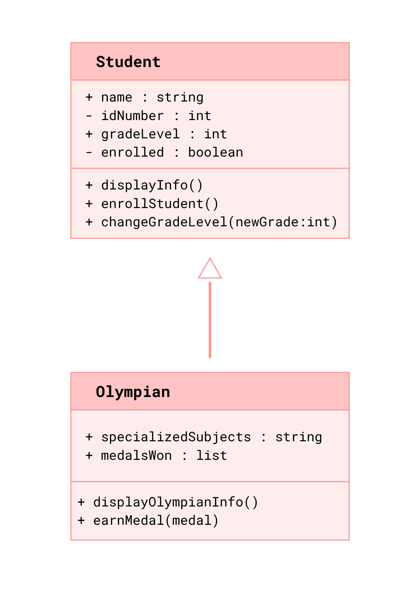

# Advanced Class Relationships
## Previous Activities
[Part I - Classes and Objects](classObjectUML.md) 
[Part II - Class Attributes and Methods](classAttributesMethods.md) 
[Part III - Class Relationships](classRelationships.md)

[classAttrib](classAttributesMethods.md)
[classRel](classRelationships.md)
## Existing System Description:
## Inheritance Relationship
Parent:
Child:
Explanation:
## Inheritance UML

## Composition/Aggregation
Relationship:
Explanation:
## Advanced UML Diagram

## Python Implementation
[Source Code](advancedRelationships.py)
## Test Run

## Object Diagram

## Reflection
Answers: