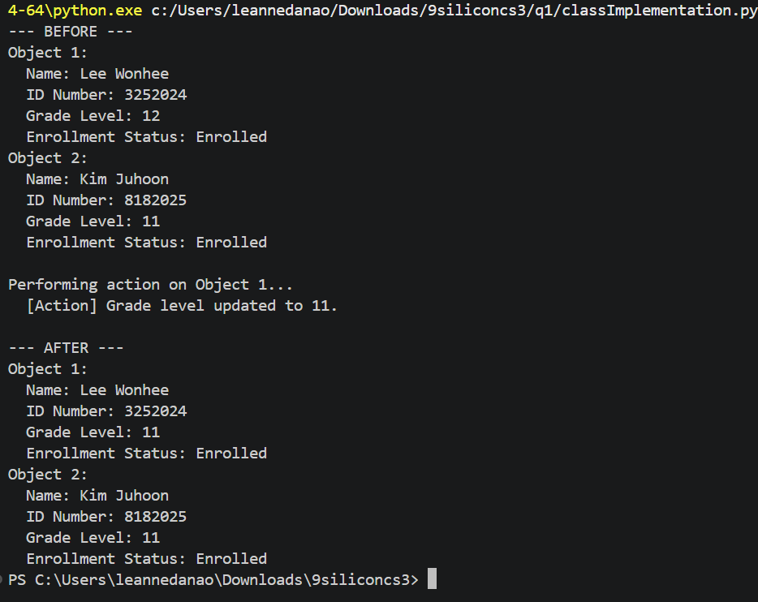
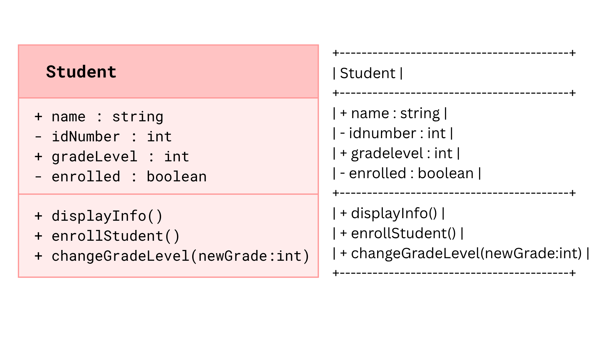

# Class Attributes and Methods
## Previous Design
Link to my previous activity:
[classObjectUML.md](classObjectUML.md)
## Design Revision
No major changes were needed from my original design.
## Visibility Decisions
| Attribute | Data Type | Visibility | Reason |
|---|---|---|---|
| name | string | Public | Easy to view and change directly because it is safe and used often. |
| idNumber | int | Private | A sensitive identifier that should remain private to prevent accidental modification. |
| gradeLevel | int | Public | Commonly updated and read by external classes, such as class lists. |
| enrolled | boolean | Private | The system must check criteria (e.g., paid tuition or complete clearance) before enrollment status can change. |
## Updated UML Class Diagram

## Python Implementation

[View Python Source](classImplementation.py)
## Test Run

## Object Diagram

## Analysis
### Why did you make your chosen attribute private?
### Which method changes the state of your object?
### How did your two objects demonstrate that instances are independent?
### What is the difference between your class diagram and your object diagram?