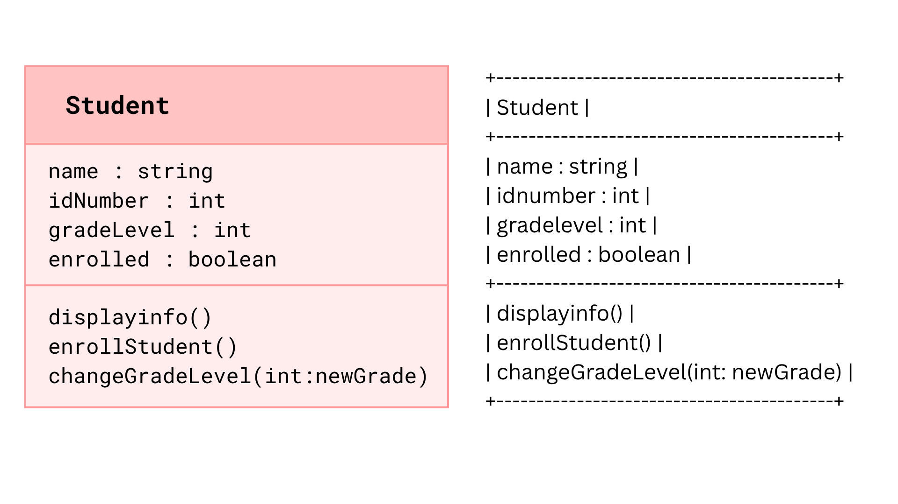

# SG4 - Understanding Classes and Objects

## Class Name: Student
## Class Description: This class represents an individual enrolled at the school. It manages their personal details and enrollment status within the school database.
## Properties
| Property | Data Type | Description |
|---|---|---|
| name | string | Full name of the student |
| idNumber | int | ID number of the student |
| gradeLevel | int | Grade level of the student |
| enrolled | boolean | Indicates if the student is enrolled |
## Methods
| Method | Description |
|---|---|
| displayInfo() | Displays the student's name, ID number, grade level, and enrollment status |
| enrollStudent() | Changes the student's enrollment status to enrolled |
| changeGradeLevel(int: newGrade) | Changes the student's grade level to the specified grade |
## Class Diagram

## Design Explanation
### Why did you choose this class?
I chose this class because I wanted the context to be related to school, which is something I am familiar with. This made it easier for me to think of realistic properties and methods based on my own experiences as a student. I also thought that a Student class would be simple to understand while still giving me enough features to demonstrate how a class works.
### Which property is the most important? Why?
I think the 'enrolled' property is the most important because it determines whether the student is currently enrolled in the school. If a student is not enrolled, then their other information/properties (name, idNumber, gradeLevel) are not relevant to the school's current records. It also helps the school keep track of which students are actively enrolled.
### Which method is the most useful? Why?
I think the 'display_info()' method is the most useful because it allows you to see all of the student's important information. Instead of checking each property individually, the method can display the student's name, ID number, grade level, and enrollment status at once. This would make it easier for the school to quickly view a student's details.