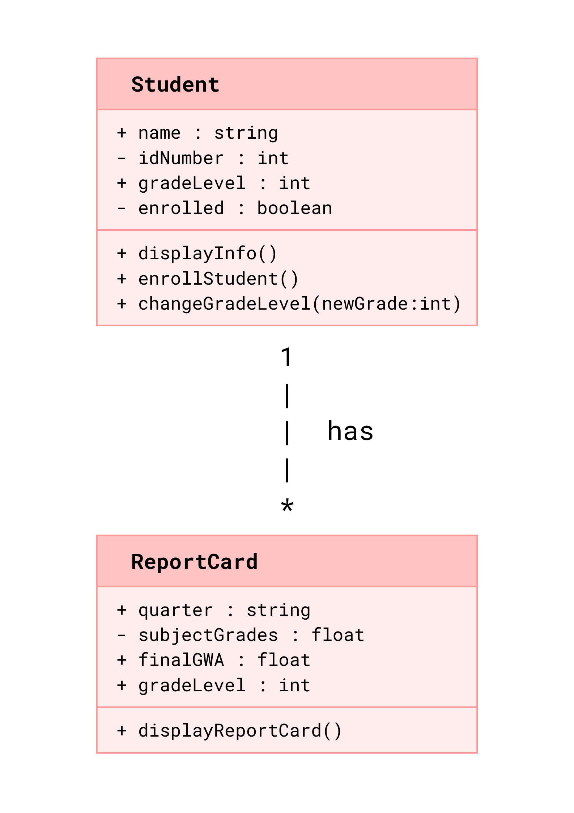
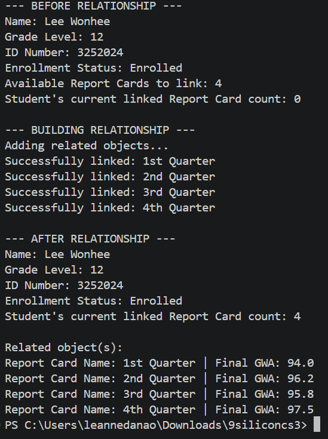
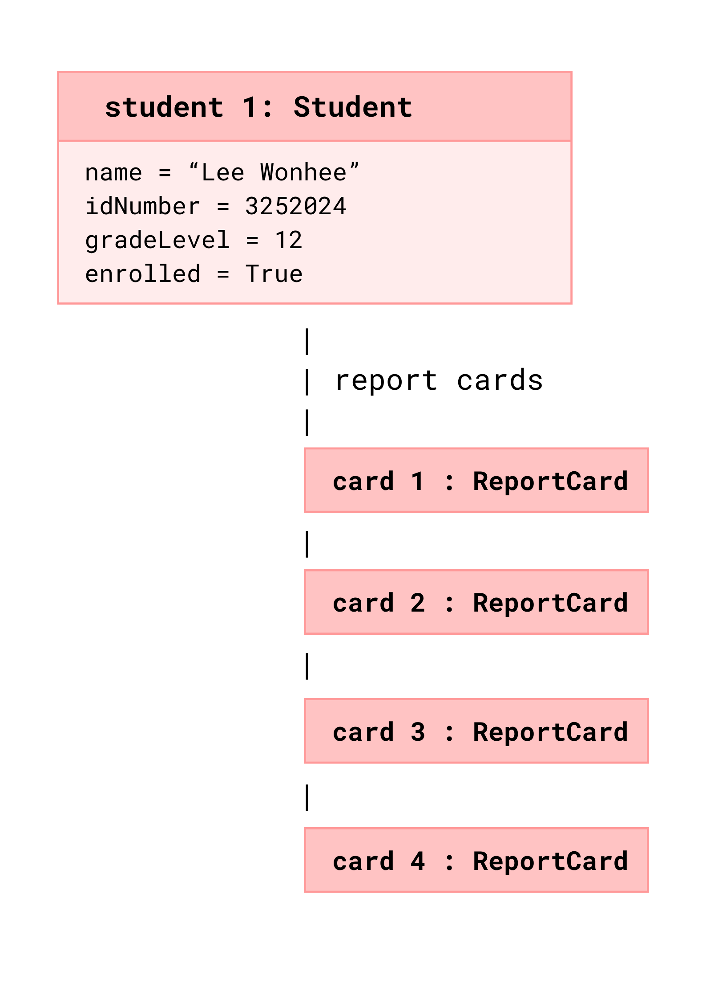

# Class Relationships: Association and Multiplicity
## Previous Work
[Part I - Classes and Objects](q1/classObjectUML.md) 
[Part II - Class Attributes and Methods](q1/classAttributesMethods.md)
## Existing Class
Class: Student 
Description: This class represents an individual enrolled at the school. The displayInfo() method outputs student details (name, gradeLevel, idNumber, enrolled) with their grades, while enrollStudent() and changeGradeLevel() ensure the report card matches their current academic status.
## New Related Class
Class: ReportCard 
Description: This class represents a transcript/progress document issued quarterly to a student. It managest data such as grades per subject, final GWA, and teacher comments. These two classes must be connected because every report card needs to belong to a specific student. Without this link, there would be no way to know whose grades and teacher comments are being recorded.
## Association
Relationship: Student HAS ReportCards 
Explanation: This relationship  connects a student's record to their academic documents. It directly links the Student to the official files that hold their grades and teacher feedback.
## Multiplicity
Multiplicity: Student 1 ───────── 0..* ReportCard 
Explanation: One Student can have many ReportCards accumulated throughout their academic life to track their grades (e.g., one for each quarter across multiple years). Conversely, each individual ReportCard is unique and can only belong to one specific student to prevent grading mix-ups.
## UML Class Relationship Diagram

## Python Implementation
[View Python Source](q1/classRelationships.py)
## Test Run

## Object Relationship Diagram

## Analysis
### What is the association between your two classes?
### What multiplicity did you choose and why?
### How did you implement the relationship in Python?
### Why did you store an object reference instead of copying its data?
### If your relationship uses many, why is a list appropriate?