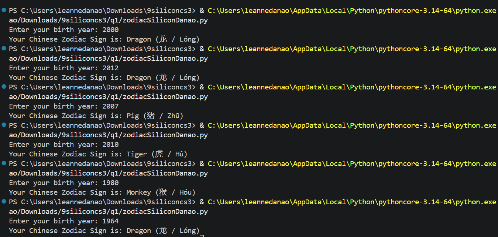

# Requirements

Create a zodiacSectionLN.py file.  This file will contain your solutions to the requirements below:

a. Ask the user to enter a year of birth.  The baseline year 1900.

b. Validate user input that it should not be earlier than 1900.

c. If the user enters an invalid year then display an appropriate message then stop or abort the program.

Example: 
Enter your birth year: 1800 
Invalid Year, it should not be earlier than 1900

d. Otherwise determine the chinese zodiac sign based on the following starting from 1900.  Note: A zodiac sign will recur after each 12 years.

i. Rat (鼠 / Shǔ)
ii. Ox (牛 / Niú)
iii. Tiger (虎 / Hǔ)
iv. Rabbit (兔 / Tù)
v. Dragon (龙 / Lóng)
vi. Snake (蛇 / Shé)
vii. Horse (马 / Mǎ)
viii. Goat (羊 / Yáng)
ix. Monkey (猴 / Hóu)
x. Rooster (鸡 / Jī)
xi. Dog (狗 / Gǒu)
xii. Pig (猪 / Zhū)

e. CONSIDER only the year of birth.

Example input and output: 
Enter your birth year: 2000 
Your Chinese Zodiac Sign is: Dragon (龙 / Lóng)

Test and Run your code before submitting.

---
# Code

#a. Ask the user to enter a year of birth.

birth_year = int(input("Enter your birth year: "))

#b. Validate user input that it should not be earlier than 1900.

#c. If the user enters an invalid year then display an appropriate message then stop or abort the program.

if birth_year < 1900:
    
    print("Invalid Year, it should not be earlier than 1900")
    
    exit()

#d. Otherwise determine the chinese zodiac sign based on the following starting from 1900. 

else:
    
    zodiacsigns = [ "Rat (鼠 / Shǔ)", "Ox (牛 / Niú)", "Tiger (虎 / Hǔ)", "Rabbit (兔 / Tù)", 
    "Dragon (龙 / Lóng)", "Snake (蛇 / Shé)", "Horse (马 / Mǎ)", "Goat (羊 / Yáng)", 
    "Monkey (猴 / Hóu)", "Rooster (鸡 / Jī)", "Dog (狗 / Gǒu)", "Pig (猪 / Zhū)"]

#e. CONSIDER only the year of birth.

index = (birth_year - 1900) % 12

print(f"Your Chinese Zodiac Sign is: {zodiacsigns[index]}")

---
# Documentation
